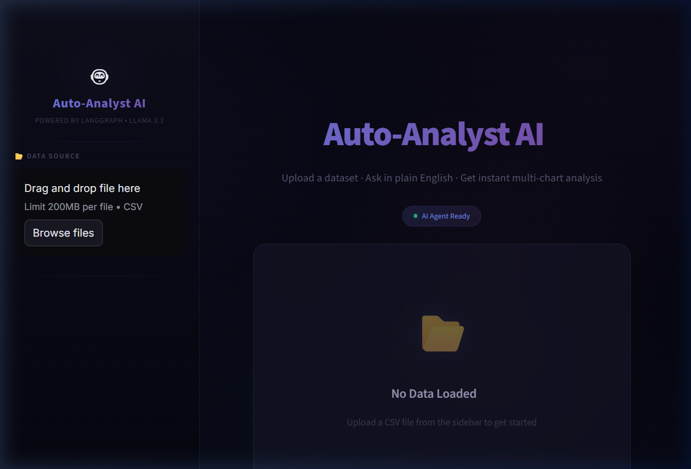
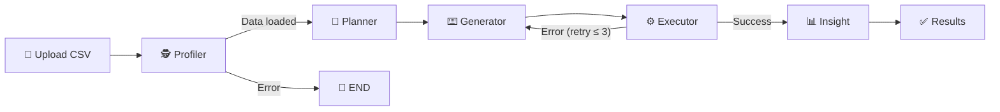

<div align="center">

# 🤖 Auto-Analyst AI

### **Your Autonomous Data Analysis Agent**

*Upload a CSV. Ask a question. Get insights, charts, and code — all powered by AI.*

[](https://python.org)
[](https://streamlit.io)
[](https://fastapi.tiangolo.com)
[](https://langchain-ai.github.io/langgraph/)
[](https://groq.com)
[](https://smith.langchain.com)
[](https://docker.com)
[](LICENSE)
[](https://agentic-data-analyst-ixxo.onrender.com)

🔗 **[Try the Live Demo →](https://agentic-data-analyst-ixxo.onrender.com)**

<br/>

**Auto-Analyst AI** is a full-stack, agentic data analysis platform that turns plain English questions into complete data insights — with charts, statistical summaries, and AI-generated narratives — all without writing a single line of code.

<br/>

> 💡 *"Show me the top 10 products by revenue and their trend over time"*
> → The agent profiles your data, plans the analysis, writes Python code, executes it in a sandbox, generates multiple charts, and delivers a polished summary.

</div>

---

## 📸 App Preview

<div align="center">
  
  <br/>
  <em>Premium dark-themed dashboard with CSV upload, real-time pipeline tracking, and AI-powered insights</em>
</div>

---

## ✨ Key Features

<table>
<tr>
<td width="50%">

### 🧠 Agentic AI Pipeline
- **5-node autonomous workflow** orchestrated by LangGraph
- Self-correcting with up to 3 retry attempts
- Structured output parsing with Pydantic schemas

### ⚡ Blazing Fast Inference
- Powered by **Llama 3.3 70B** via **Groq API**
- Sub-second LLM response times
- Separate temperature configs for planning (creative) vs coding (deterministic)

### 🔒 Secure Code Execution
- Sandboxed `exec()` with restricted builtins
- Dangerous patterns blocked (subprocess, shutil, etc.)
- Import stripping — libraries pre-injected

</td>
<td width="50%">

### 📊 Multi-Chart Generation
- Generates **4–5 publication-quality visualizations** per query
- Seaborn + Matplotlib with beautiful color palettes
- Distribution, correlation, comparison, and ranking charts
- All charts saved to `data/output/` for easy access

### 🎨 Premium Streamlit Frontend
- **Interactive web UI** with glassmorphism dark theme
- Drag-and-drop CSV upload with instant data preview
- Real-time pipeline status tracking with animated steps
- Chart gallery, code panel, and AI-generated insight display
- Quick prompt suggestions for common analysis types

### 🐳 One-Command Deployment
- Single Docker image (FastAPI + Streamlit + Supervisord)
- `docker-compose up` and you're live
- Production-ready with health checks

</td>
</tr>
</table>

---

## 🏗️ System Architecture

```
┌─────────────────────────────────────────────────────────────────────────┐
│                         AUTO-ANALYST AI                                │
├──────────────────────────────┬──────────────────────────────────────────┤
│        FRONTEND              │              BACKEND                    │
│   Streamlit (Port 8501)      │         FastAPI + LangGraph             │
│                              │                                        │
│  ┌────────────────────┐      │   ┌──────────────────────────────────┐  │
│  │  📂 File Upload    │──────┼──▶│  POST /api/upload                │  │
│  └────────────────────┘      │   └──────────────────────────────────┘  │
│  ┌────────────────────┐      │   ┌──────────────────────────────────┐  │
│  │  💬 Query Input    │──────┼──▶│  POST /api/analyze               │  │
│  └────────────────────┘      │   └───────────────┬──────────────────┘  │
│  ┌────────────────────┐      │                   │                    │
│  │  ⚙️ Pipeline Status│      │                   ▼                    │
│  │  📊 Chart Gallery  │◀─────┼───  LangGraph Agent Pipeline          │
│  │  💻 Code Panel     │      │   ┌────────────────────────────────┐   │
│  │  📝 Insight Panel  │      │   │  Profiler → Planner → Generator│   │
│  └────────────────────┘      │   │  → Executor → Insight          │   │
│                              │   └────────────────────────────────┘   │
└──────────────────────────────┴──────────────────────────────────────────┘
```

---

## 🔄 Agent Pipeline — How It Works

The agent operates as a **stateful graph** where each node performs a specialized task:



| Stage | Node | What It Does |
|-------|------|--------------|
| **1** | 🕵️ **Profiler** | Loads the CSV, extracts schema, generates a statistical summary |
| **2** | 🧠 **Planner** | Creates a multi-step analysis plan covering distributions, comparisons, correlations |
| **3** | ⌨️ **Generator** | Writes Python code (Pandas + Matplotlib + Seaborn) to execute the plan |
| **4** | ⚙️ **Executor** | Runs code in a secure sandbox, captures stdout and saves charts to `data/output/` |
| **5** | 📊 **Insight** | Summarizes all findings in plain English for non-technical audiences |

> 🔄 **Self-Correcting**: If code execution fails, the agent reflects on the error and regenerates fixed code — up to 3 attempts.

---

## 🛠️ Tech Stack

<div align="center">

| Layer | Technology | Purpose |
|-------|-----------|---------|
| **LLM** | Llama 3.3 70B (via Groq) | Reasoning, planning, code generation |
| **Agent Framework** | LangGraph | Stateful graph orchestration with conditional edges |
| **Observability** | LangSmith | End-to-end agent tracing & debugging |
| **Backend API** | FastAPI + Uvicorn | REST API for upload, analysis, and chart serving |
| **Frontend** | Streamlit | Interactive web UI with drag-and-drop uploads |
| **Data Science** | Pandas, NumPy, Matplotlib, Seaborn | Data manipulation and visualization |
| **Structured Output** | Pydantic + LangChain JsonOutputParser | Type-safe LLM responses |
| **Embeddings** | HuggingFace (all-MiniLM-L6-v2) | Sentence embeddings with GPU/CPU auto-detection |
| **Deployment** | Docker + Supervisord | Production-ready containerization |

</div>

---

## 🚀 Getting Started

### Prerequisites

- **Python 3.11+**
- **Groq API Key** — [Get one free at groq.com](https://console.groq.com/keys)
- *(Optional)* **LangSmith API Key** — [Get one at smith.langchain.com](https://smith.langchain.com) for agent tracing

### 1️⃣ Clone the Repository

```bash
git clone https://github.com/prvn-kumar01/Agentic-Data-Analyst.git
cd Agentic-Data-Analyst
```

### 2️⃣ Set Up Environment Variables

Create a `.env` file in the project root:

```env
GROQ_API_KEY=your_groq_api_key_here

# Optional: Enable LangSmith Tracing
LANGCHAIN_TRACING_V2=true
LANGCHAIN_API_KEY=your_langsmith_api_key_here
```

### 3️⃣ Install Dependencies

```bash
# Create virtual environment (recommended)
python -m venv venv
source venv/bin/activate   # Linux/Mac
venv\Scripts\activate      # Windows

# Install dependencies
pip install -r requirements.txt
```

### 4️⃣ Run the Application

**Option A — Full-Stack (Streamlit + FastAPI):**

```bash
# Terminal 1: Start the FastAPI backend
python server.py

# Terminal 2: Start the Streamlit frontend
streamlit run streamlit_app.py
```

Then open **http://localhost:8501** in your browser.

**Option B — CLI Mode (No UI):**

```bash
python main.py
```

> 📁 All generated charts are saved to `data/output/` directory.

---

## 🐳 Docker Deployment

> 🌐 **Live on Render** — [https://agentic-data-analyst-ixxo.onrender.com](https://agentic-data-analyst-ixxo.onrender.com)

Deploy the entire stack with a single command:

```bash
# Build and run
docker-compose up --build

# Access the app
open http://localhost:8501
```

The Docker setup runs **Streamlit + FastAPI** in a single container using **Supervisord** as the process manager:
- **Streamlit UI** → Port `8501`
- **FastAPI API** → Port `8000`

---

## 📁 Project Structure

```
Auto-Analyst-AI/
│
├── 🐍 Backend (Python)
│   ├── server.py              # FastAPI REST API server
│   ├── main.py                # CLI entry point (interactive mode)
│   ├── config.py              # LLM & embedding configuration (Groq + HuggingFace)
│   ├── streamlit_app.py       # Streamlit web UI (premium dark theme)
│   └── src/
│       ├── graph.py           # LangGraph workflow definition
│       ├── nodes.py           # 5 agent nodes (profiler → insight)
│       ├── state.py           # AgentState TypedDict schema
│       ├── schema.py          # Pydantic models for structured output
│       ├── prompts.py         # All LLM prompt templates
│       ├── tools.py           # Sandboxed code execution engine
│       └── utils.py           # CSV profiling utilities
│
├── 📂 Data
│   └── data/
│       ├── input/             # Uploaded CSV files
│       └── output/            # Generated charts (output_1.png, etc.)
│
├── 🐳 Deployment
│   ├── Dockerfile             # Single-stage Python 3.11 build
│   ├── docker-compose.yml     # One-command deployment
│   └── supervisord.conf       # Process manager (FastAPI + Streamlit)
│
├── 🎨 Assets
│   └── assets/                # Screenshots & media for README
│
├── requirements.txt           # Python dependencies
├── .env                       # API keys (not committed)
└── .gitignore                 # Git ignore rules
```

---

## 🔌 API Reference

| Method | Endpoint | Description |
|--------|----------|-------------|
| `POST` | `/api/upload` | Upload a CSV file, returns data preview with column metadata |
| `POST` | `/api/analyze` | Run the full agent pipeline, returns insights + chart URLs + code |
| `GET` | `/api/charts/{filename}` | Serve a generated chart image from `data/output/` |
| `GET` | `/api/health` | Health check endpoint |

> 📖 **Interactive API Docs**: Visit `http://localhost:8000/docs` for Swagger UI when the server is running.

<details>
<summary><strong>📋 Example: Analyze Endpoint Response</strong></summary>

```json
{
  "success": true,
  "insight": "Based on the analysis, the top 5 products by revenue are...",
  "charts": ["/api/charts/output_1.png", "/api/charts/output_2.png"],
  "code": "df = pd.read_csv('data/input/sales.csv')...",
  "code_output": "Total Revenue: $1,234,567\nTop Product: Widget A",
  "plan": ["Load data", "Group by product", "Calculate revenue", "Plot top 10"],
  "node_log": [
    {"node": "profiler", "status": "completed"},
    {"node": "planner", "status": "completed", "plan": ["..."]},
    {"node": "generator", "status": "completed", "code_length": 1250},
    {"node": "executor", "status": "completed", "output": "..."},
    {"node": "insight", "status": "completed"}
  ]
}
```
</details>

---

## 🧩 How the Agent Thinks

Here's what happens under the hood when you ask *"What are the sales trends by region?"*:

```
1. 🕵️ PROFILER
   → Reads CSV, detects 12 columns, 50,000 rows
   → Identifies: Region (categorical), Sales (numeric), Date (datetime)

2. 🧠 PLANNER  (temperature=0.2 — creative reasoning)
   → Step 1: Load and clean data
   → Step 2: Group by Region, calculate total sales
   → Step 3: Plot time-series trends per region
   → Step 4: Create a heatmap of region × month
   → Step 5: Show top/bottom performing regions

3. ⌨️ GENERATOR  (temperature=0 — deterministic coding)
   → Writes ~80 lines of Pandas + Matplotlib code
   → Creates 4 subplots with seaborn styling

4. ⚙️ EXECUTOR
   → Runs code in sandbox → Saves 4 charts to data/output/ + captures stats

5. 📊 INSIGHT
   → "The Western region leads with $2.3M in total sales,
      showing a 15% growth trend. The Southern region
      underperforms with declining Q3 numbers..."
```

---

## 🔒 Security

The code execution engine includes multiple layers of protection:

- ✅ **Restricted Builtins** — Only safe Python builtins are available
- ✅ **Import Stripping** — All import statements are removed; libraries are pre-injected
- ✅ **Pattern Blocking** — `subprocess`, `shutil`, `importlib`, `__import__` are blocked
- ✅ **Isolated Scope** — Code runs in a separate namespace, not the main process
- ✅ **Output Capture** — Stdout is redirected and captured safely

---

## 📡 Observability with LangSmith

Auto-Analyst AI supports **LangSmith tracing** out of the box for full agent observability:

- 🔍 **End-to-end trace** of every LLM call across all 5 pipeline nodes
- 📊 **Token usage** and latency metrics per node
- 🐛 **Debug failed runs** by inspecting exact prompts and responses
- 📈 **Monitor production** performance over time

Enable tracing by setting `LANGCHAIN_TRACING_V2=true` and providing your `LANGCHAIN_API_KEY` in the `.env` file.

---

## 🤝 Contributing

Contributions are welcome! Here's how to get started:

1. **Fork** the repository
2. **Create** a feature branch: `git checkout -b feature/amazing-feature`
3. **Commit** your changes: `git commit -m 'Add amazing feature'`
4. **Push** to the branch: `git push origin feature/amazing-feature`
5. **Open** a Pull Request

---

## 📜 License

This project is licensed under the **MIT License** — see the [LICENSE](LICENSE) file for details.

---

## 🙋‍♂️ Author

<div align="center">

**Praveen Kumar**

[](https://github.com/prvn-kumar01)

---

*If you found this project useful, please consider giving it a ⭐!*

</div>
