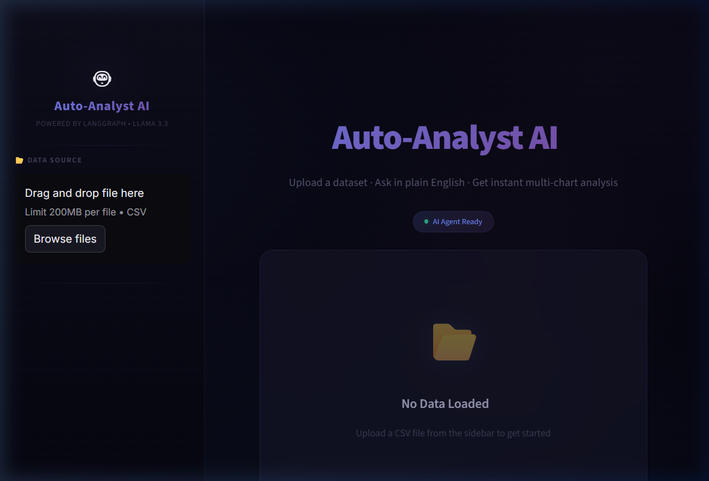

<div align="center">

<br/>


<br/><br/>

# Auto-Analyst AI

### The Open-Source Autonomous Data Analysis Agent

*Drop a dataset. Ask a question. Get publication-ready charts, statistical insights, and executive narratives — in seconds.*

<br/>

[](https://python.org)
[](https://langchain-ai.github.io/langgraph/)
[](https://groq.com)
[](https://e2b.dev)
[](https://fastapi.tiangolo.com)
[](https://streamlit.io)
[](https://docker.com)
[](https://aws.amazon.com)
[](LICENSE)

<br/>

[**Getting Started**](#-quickstart) · [**Architecture**](#-architecture) · [**API Reference**](#-api-reference) · [**Deploy to AWS**](#-production-deployment-aws-ec2) · [**Contributing**](#-contributing)

<br/>



<br/><br/>

</div>

---

## 🎯 What is Auto-Analyst AI?

**Auto-Analyst AI** is a fully autonomous data analysis agent that replaces the workflow of a junior data analyst. You give it a dataset and a question in plain English — it **profiles** your data, **plans** a multi-angle analysis, **writes** Python code, **executes** it in a secure cloud sandbox, and **delivers** interactive visualizations with human-readable business insights.

**No code. No configuration. No data science experience required.**

<br/>

<table>
<tr>
<td width="33%" align="center">
<h3>📂</h3>
<strong>Multi-Format Ingestion</strong><br/>
<sub>CSV · Excel · JSON · PDF Tables</sub>
</td>
<td width="33%" align="center">
<h3>🤖</h3>
<strong>Autonomous Pipeline</strong><br/>
<sub>Profile → Plan → Code → Execute → Insight</sub>
</td>
<td width="33%" align="center">
<h3>📊</h3>
<strong>Interactive Charts</strong><br/>
<sub>3-5 Plotly visualizations per query</sub>
</td>
</tr>
<tr>
<td width="33%" align="center">
<h3>🔒</h3>
<strong>Sandbox Execution</strong><br/>
<sub>Code runs in isolated E2B cloud VMs</sub>
</td>
<td width="33%" align="center">
<h3>🔄</h3>
<strong>Self-Healing</strong><br/>
<sub>Auto-debugs and retries up to 3x</sub>
</td>
<td width="33%" align="center">
<h3>📦</h3>
<strong>Export Everything</strong><br/>
<sub>ZIP with report, code, and charts</sub>
</td>
</tr>
</table>

---

## ⚡ How It Works

> *"Show me revenue distribution and correlations across product categories"*


```mermaid
graph LR
    A["📂 Upload\nCSV / Excel / PDF"] --> B["📋 Data Profiler\n<i>Schema, types, stats</i>"]
    B --> C["🗺️ Analysis Planner\n<i>Multi-angle strategy</i>"]
    C --> D["💻 Code Generator\n<i>GPT OSS 120B via Groq</i>"]
    D --> E["⚡ Sandbox Executor\n<i>E2B isolated cloud VM</i>"]
    E -->|"✅ Success"| F["🧠 Insight Engine\n<i>Executive narratives</i>"]
    E -->|"❌ Error"| D
    F --> G["📊 Interactive Dashboard\n<i>Plotly charts + report</i>"]

    style A fill:#1e293b,stroke:#6366f1,color:#f1f5f9
    style B fill:#1e293b,stroke:#8b5cf6,color:#f1f5f9
    style C fill:#1e293b,stroke:#8b5cf6,color:#f1f5f9
    style D fill:#1e293b,stroke:#ec4899,color:#f1f5f9
    style E fill:#1e293b,stroke:#22d3ee,color:#f1f5f9
    style F fill:#1e293b,stroke:#8b5cf6,color:#f1f5f9
    style G fill:#059669,stroke:#34d399,color:#f1f5f9
```

| Step | Agent Node | What It Does |
|:----:|:-----------|:-------------|
| 1 | **Data Profiler** | Loads any format, detects encoding, extracts schema with dtypes, null counts, and sample values |
| 2 | **Analysis Planner** | Creates a 4-5 step analytical strategy: distributions, correlations, comparisons, rankings, trends |
| 3 | **Code Generator** | Synthesizes production-grade Pandas + Plotly code using GPT OSS 120B (120B param model via Groq) |
| 4 | **Sandbox Executor** | Executes code in E2B isolated micro-VM — downloads generated charts to local storage |
| 5 | **Insight Engine** | Interprets raw output into executive-ready business narratives with key takeaways |

> The pipeline **self-heals**: if code execution fails, the agent reflects on the error, rewrites the code, and retries automatically (up to 3 attempts).

---

## 🏗️ Architecture

```
                    ┌─────────────────────────────────────────────────────┐
                    │              DOCKER CONTAINER (EC2)                 │
                    │                                                     │
   Browser ──────▶  │   ┌─────────┐                                      │
   (Port 80)       │   │  NGINX  │──▶ Streamlit UI  (:8501)             │
                    │   │  Proxy  │──▶ FastAPI API   (:8000)             │
                    │   └─────────┘                                      │
                    │        │                                            │
                    │        ▼                                            │
                    │   ┌─────────────────────────────────────────┐      │
                    │   │           FastAPI + LangGraph            │      │
                    │   │                                         │      │
                    │   │   Profiler → Planner → Generator        │      │
                    │   │              ↗ retry                    │      │
                    │   │   Executor ←─┘     → Insight Engine     │      │
                    │   └──────────┬──────────────────────────────┘      │
                    │              │                                      │
                    └──────────────┼──────────────────────────────────────┘
                                   │
                    ┌──────────────┼──────────────┐
                    │              ▼              │
                    │    ☁️ E2B Cloud Sandbox     │     🧠 Groq API
                    │    (Isolated Code Exec)     │     (GPT OSS 120B)
                    └────────────────────────────┘
```

---

## 🛠️ Tech Stack

| Layer | Technology | Purpose |
|:------|:-----------|:--------|
| **LLM** | [Groq](https://groq.com) — `openai/gpt-oss-120b` | Ultra-fast 120B parameter model for planning, code synthesis, and insights |
| **Agent Framework** | [LangGraph](https://langchain-ai.github.io/langgraph/) + LangChain | Stateful cyclic graph orchestration with conditional routing and checkpointing |
| **Code Sandbox** | [E2B](https://e2b.dev) Code Interpreter v2 | Secure, isolated Linux micro-VMs for executing AI-generated code |
| **Backend** | [FastAPI](https://fastapi.tiangolo.com) + Uvicorn | Async REST API with job isolation, file serving, and ZIP export |
| **Frontend** | [Streamlit](https://streamlit.io) | Glassmorphism dark-themed dashboard with real-time pipeline tracking |
| **Visualizations** | [Plotly](https://plotly.com/python/) Express + Graph Objects | Interactive, publication-grade charts with zoom, pan, and hover |
| **Data Processing** | Pandas · NumPy · PDFPlumber | Multi-format ingestion, encoding detection, and table extraction |
| **Infrastructure** | Docker · Nginx · Supervisord | Single-container deployment with reverse proxy and process management |
| **Cloud** | AWS EC2 (Free Tier) | Production hosting with systemd auto-start, UFW firewall, health monitoring |

---

## 🚀 Quickstart

### Prerequisites

| Requirement | How to Get |
|:------------|:-----------|
| Python 3.11+ | [python.org/downloads](https://python.org/downloads) |
| Groq API Key | [console.groq.com/keys](https://console.groq.com/keys) *(free)* |
| E2B API Key | [e2b.dev/dashboard](https://e2b.dev/dashboard) *(free)* |

### Install & Run

```bash
# Clone the repository
git clone https://github.com/prvn-kumar01/Agentic-Data-Analyst.git
cd Agentic-Data-Analyst

# Create virtual environment
python -m venv venv
source venv/bin/activate        # Linux / macOS
venv\Scripts\activate           # Windows

# Install dependencies
pip install -r requirements.txt

# Configure environment
cp .env.example .env
# Edit .env and add your GROQ_API_KEY and E2B_API_KEY
```

**Option A — Web UI (recommended)**

```bash
# Terminal 1: Backend
python server.py

# Terminal 2: Frontend
streamlit run streamlit_app.py
```

Open **http://localhost:8501** → Upload a CSV → Ask a question → Get results.

**Option B — CLI Mode**

```bash
python main.py
# Follow the interactive prompts
```

**Option C — Docker (one command)**

```bash
docker-compose up -d --build
# Open http://localhost in your browser
```

---

## 🌐 Production Deployment (AWS EC2)

Fully optimized for **AWS Free Tier** (`t2.micro` — 1 vCPU, 1 GB RAM). The deploy script handles everything: swap memory, Docker, Nginx reverse proxy, firewall, systemd auto-start, and health monitoring.

### Launch EC2 Instance

| Setting | Value |
|:--------|:------|
| **AMI** | Ubuntu 22.04 LTS (Free tier eligible) |
| **Instance Type** | `t2.micro` |
| **Storage** | 20 GB gp2 SSD |
| **Security Group** | SSH (22) → Your IP, HTTP (80) → Anywhere |

### One-Click Deploy

```bash
# SSH into your EC2 instance
ssh -i your-key.pem ubuntu@YOUR-EC2-IP

# Clone and deploy
git clone https://github.com/prvn-kumar01/Agentic-Data-Analyst.git
cd Agentic-Data-Analyst
cp .env.example .env && nano .env    # Add your API keys

chmod +x deploy_ec2.sh
./deploy_ec2.sh
```

**That's it.** Your app is live at `http://YOUR-EC2-IP/`

### What the Deploy Script Does

```
✅ Creates 2GB swap memory (prevents OOM on 1GB RAM)
✅ Installs Docker & Docker Compose
✅ Configures UFW firewall (SSH + HTTP only)
✅ Builds & launches the Docker container
✅ Sets up systemd service (auto-start on boot)
✅ Installs health check cron (every 5 minutes)
✅ Verifies deployment and prints access URLs
```

### Operations

```bash
./scripts/monitor.sh          # System dashboard (CPU, RAM, disk, Docker status)
./scripts/health_check.sh     # Health check with auto-restart
./scripts/backup.sh           # Backup data & configs
sudo docker-compose logs -f   # View live logs
sudo docker-compose restart   # Restart services
```

---

## 🔌 API Reference

All endpoints are accessible at `http://YOUR-HOST/api/` (proxied through Nginx) or directly at `:8000` in development.

| Method | Endpoint | Description |
|:------:|:---------|:------------|
| `POST` | `/api/upload` | Upload CSV, Excel, or JSON file. Returns schema preview with column types, null counts, and sample values. |
| `POST` | `/api/upload-pdf` | Upload PDF with tabular data. Extracts tables, converts to CSV, returns preview. |
| `POST` | `/api/analyze` | Execute the full agent pipeline. Params: `filepath`, `query`, `thread_id` (optional). Returns insights, charts, code, and execution log. |
| `GET` | `/api/charts/{job_id}/{filename}` | Serve a generated chart (Plotly JSON, PNG, SVG, or HTML) from a specific analysis job. |
| `GET` | `/api/download-report/{job_id}` | Download complete analysis bundle as ZIP (report, charts, Python script). |
| `GET` | `/api/health` | Health check endpoint. Returns `{"status": "ok"}`. |

> 📖 **Interactive docs** available at `/docs` (Swagger UI) and `/redoc` (ReDoc) when the server is running.

### Example: Analyze via cURL

```bash
# Upload a file
curl -X POST http://localhost/api/upload \
  -F "file=@sales_data.csv"

# Run analysis
curl -X POST http://localhost/api/analyze \
  -F "filepath=/app/data/input/sales_data.csv" \
  -F "query=Show me monthly revenue trends and top performing categories"

# Download report
curl -O http://localhost/api/download-report/abc1234567
```

---

## 🔒 Security

| Layer | Protection |
|:------|:-----------|
| **Code Execution** | All AI-generated code runs in isolated E2B cloud micro-VMs — zero access to host filesystem or network |
| **Execution Limits** | 60-second timeout per execution. Automatic termination of infinite loops |
| **Network** | Nginx reverse proxy with security headers (X-Frame-Options, X-Content-Type-Options, X-XSS-Protection) |
| **Firewall** | UFW configured to allow only SSH (22) and HTTP (80). Internal ports 8000/8501 not exposed |
| **CORS** | Configurable via `ALLOWED_ORIGINS` environment variable |
| **Upload Limits** | 50MB max file size enforced at Nginx level |
| **Job Isolation** | Each analysis runs in a unique `job_id` directory — multi-tenant safe |

---

## 📁 Project Structure

```
Auto-Analyst-AI/
├── streamlit_app.py          # Streamlit frontend (glassmorphism dark UI)
├── server.py                 # FastAPI backend (REST API + job management)
├── main.py                   # CLI entry point
├── config.py                 # LLM configuration (Groq models)
├── src/
│   ├── graph.py              # LangGraph state machine (5-node pipeline)
│   ├── nodes.py              # Agent node implementations
│   ├── prompts.py            # LLM prompt templates
│   ├── schema.py             # Pydantic output schemas
│   ├── state.py              # AgentState TypedDict
│   ├── tools.py              # E2B sandbox execution engine
│   └── utils.py              # Data profiling utilities
├── nginx.conf                # Nginx reverse proxy configuration
├── Dockerfile                # Production Docker image
├── docker-compose.yml        # Container orchestration
├── supervisord.conf          # Multi-process management (Nginx + FastAPI + Streamlit)
├── deploy_ec2.sh             # One-click AWS EC2 deploy script
├── scripts/
│   ├── health_check.sh       # Cron-based health monitoring + auto-restart
│   ├── backup.sh             # Data & config backup with rotation
│   └── monitor.sh            # System resource dashboard
├── requirements.txt          # Python dependencies
├── .env.example              # Environment variable template
└── assets/
    └── app_screenshot.png    # UI screenshot
```

---

## 🤝 Contributing

Contributions are welcome! Here's how:

1. **Fork** the repository
2. Create a feature branch: `git checkout -b feature/amazing-feature`
3. Commit your changes: `git commit -m 'Add amazing feature'`
4. Push to the branch: `git push origin feature/amazing-feature`
5. Open a **Pull Request**

---

## 📜 License

Distributed under the **MIT License**. See [`LICENSE`](LICENSE) for details.

---

<div align="center">

<br/>

**Built by [Praveen Kumar](https://github.com/prvn-kumar01)**

[](https://github.com/prvn-kumar01)
[](https://linkedin.com/in/prvn-kumar01)

<br/>

If this project helped you, consider giving it a ⭐

<br/>

</div>
