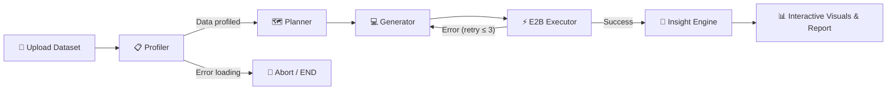

<div align="center">

# 🤖 Auto-Analyst AI

### **Autonomous Data Analysis Agent powered by LangGraph, Groq & E2B**

*Upload CSV, Excel, JSON, or PDF tables. Ask questions in plain English. Get instant interactive Plotly charts, statistical summaries, and AI-generated insights.*

[](https://python.org)
[](https://streamlit.io)
[](https://fastapi.tiangolo.com)
[](https://langchain-ai.github.io/langgraph/)
[](https://groq.com)
[](https://e2b.dev)
[](https://plotly.com)
[](https://docker.com)
[](LICENSE)
[](https://agentic-data-analyst-ixxo.onrender.com)

🔗 **[Try the Live Demo →](https://agentic-data-analyst-ixxo.onrender.com)**

<br/>

**Auto-Analyst AI** is a full-stack autonomous data analyst agent that transforms natural language questions into comprehensive analytics workflows — producing interactive charts, summary statistics, and executive narratives without writing a single line of code.

<br/>

> 💡 *"Show me the top 10 products by revenue and their distribution over time"*
> → The agent profiles your dataset, formulates a multi-angle analysis plan, writes Python code, executes it in a secure isolated cloud sandbox (E2B), captures interactive Plotly figures, and delivers human-readable business insights with an exportable ZIP report.

</div>

---

## ✨ Key Features

<table>
<tr>
<td width="50%">

### 🧠 Autonomous Agent Pipeline
- **5-Node StateGraph** orchestrated by LangGraph (`profiler` → `planner` → `generator` → `executor` → `insight`)
- **Self-Healing & Auto-Debugging**: automatically reflects on execution errors and retries up to 3 times
- Stateful conversation memory via SQLite / In-Memory checkpointers

### ⚡ Ultra-Fast Cloud Inference
- Powered by high-speed reasoning models on **Groq** (`openai/gpt-oss-120b`, `llama-3.3-70b-versatile`)
- Sub-second planning and deterministic code synthesis
- Fully configurable via `GROQ_MODEL` environment variable

### 🔒 Cloud-Isolated Sandbox (E2B)
- Code executes in isolated, secure Linux micro-VMs via **E2B Code Interpreter**
- Safe from malicious execution, resource leaks, or local environment pollution
- Automated data transfer and headless chart extraction

</td>
<td width="50%">

### 📊 Multi-Chart Interactive Gallery
- Generates **3–5 publication-grade Plotly interactive charts** per analysis query
- Interactive zoom, pan, hover tooltips, and responsive layout
- Fallback support for Seaborn and Matplotlib figures

### 📂 Multi-Format File Ingestion
- Upload **CSV**, **Excel (.xlsx, .xls)**, **JSON**, or extract tables from **PDF** documents
- Automatic encoding detection & data type profiling
- Instant schema preview with column missing value metrics

### 📦 Report Bundle & Export
- Download complete analysis bundle as a **ZIP file** (includes `report.md`, Python script, and chart assets)
- Glassmorphism dark-themed UI built on Streamlit with quick-prompt chips
- One-click containerized deployment (FastAPI + Streamlit via Supervisord)

</td>
</tr>
</table>

---

## 🏗️ System Architecture

```
┌─────────────────────────────────────────────────────────────────────────────────┐
│                              AUTO-ANALYST AI                                    │
├───────────────────────────────┬─────────────────────────────────────────────────┤
│        FRONTEND               │                   BACKEND                       │
│    Streamlit (Port 8501)      │              FastAPI + LangGraph                │
│                               │                                                 │
│  ┌─────────────────────┐      │   ┌─────────────────────────────────────────┐   │
│  │ 📂 File Upload      │──────┼──▶│  POST /api/upload /api/upload-pdf       │   │
│  │    (CSV/XLSX/PDF)   │      │   └─────────────────────────────────────────┘   │
│  └─────────────────────┘      │   ┌─────────────────────────────────────────┐   │
│  ┌─────────────────────┐      │   │  POST /api/analyze                      │   │
│  │ 💬 Query Input      │──────┼──▶│   ├── 1. Data Profiler                  │   │
│  │    & Prompt Chips   │      │   │   ├── 2. Analysis Planner               │   │
│  └─────────────────────┘      │   │   ├── 3. Code Generator (Groq)          │   │
│  ┌─────────────────────┐      │   │   ├── 4. E2B Sandbox Executor           │   │
│  │ ⚙️ Pipeline Status  │      │   │   └── 5. Insight Engine                 │   │
│  │ 📈 Plotly Gallery   │◀─────┼───│  GET  /api/charts/{job_id}/{file}       │   │
│  │ 💻 Python Script    │      │   │  GET  /api/download-report/{job_id}     │   │
│  │ 📥 Download ZIP     │      │   └─────────────────────────────────────────┘   │
│  └─────────────────────┘      │                                                 │
└───────────────────────────────┴─────────────────────────────────────────────────┘
```

---

## 🔄 Agent Pipeline — Workflow


```mermaid
graph LR
    A["📂 Upload Dataset"] --> B["📋 Profiler"]
    B -->|"Data profiled"| C["🗺️ Planner"]
    B -->|"Error loading"| Z["🛑 Abort / END"]
    C --> D["💻 Generator"]
    D --> E["⚡ E2B Executor"]
    E -->|"Success"| F["🧠 Insight Engine"]
    E -->|"Error (retry ≤ 3)"| D
    F --> G["📊 Interactive Visuals & Report"]
```

| Step | Node | Responsibility |
|:---|:---|:---|
| **1** | 📋 **Profiler** | Loads data, handles encodings, extracts schema, and builds statistical context |
| **2** | 🗺️ **Planner** | Creates a 5-step analytical plan (distributions, correlations, trends, group-by, rankings) |
| **3** | 💻 **Generator** | Synthesizes Pandas + Plotly code with column normalization |
| **4** | ⚡ **Executor** | Runs code in remote E2B Sandbox, captures stdout and saves `output_*.json` charts |
| **5** | 🧠 **Insight** | Delivers plain-English business takeaways and summaries based on execution results |

---

## 🛠️ Tech Stack

<div align="center">

| Component | Technology | Role |
|:---|:---|:---|
| **LLM Inference** | Groq (`openai/gpt-oss-120b` / `llama-3.3-70b`) | Planning, Code Synthesis, Business Insights |
| **Agent Orchestration** | LangGraph & LangChain | Stateful cyclic graph pipeline with retries |
| **Execution Sandbox** | E2B Code Interpreter v2 | Cloud-isolated Python sandbox execution |
| **Backend REST API** | FastAPI + Uvicorn | Asynchronous job dispatch and asset serving |
| **Frontend UI** | Streamlit 1.60+ | Glassmorphism dashboard, Plotly interactive viewer |
| **Visualizations** | Plotly Express & Plotly.js | Dynamic, interactive charts |
| **Document Processing** | Pandas, NumPy, PDFPlumber | Tabular parsing & PDF table extraction |
| **Deployment** | Docker & Supervisord | Multi-process container packaging |

</div>

---

## 🚀 Getting Started

### Prerequisites
- **Python 3.11+**
- **Groq API Key** — [Get free key at console.groq.com](https://console.groq.com/keys)
- **E2B API Key** — [Get free key at e2b.dev](https://e2b.dev)

### 1️⃣ Clone the Repository
```bash
git clone https://github.com/prvn-kumar01/Agentic-Data-Analyst.git
cd Agentic-Data-Analyst
```

### 2️⃣ Set Up Environment Variables
Create a `.env` file in the root directory:
```env
GROQ_API_KEY=gsk_your_groq_api_key_here
E2B_API_KEY=e2b_your_e2b_api_key_here

# Optional: Override default Groq model
GROQ_MODEL=openai/gpt-oss-120b

# Optional: HuggingFace Embeddings
HUGGINGFACEHUB_API_TOKEN=your_token_here

# Optional: LangSmith Agent Tracing
LANGCHAIN_TRACING_V2=true
LANGCHAIN_API_KEY=your_langsmith_key_here
```

### 3️⃣ Install Dependencies
```bash
# Create and activate virtual environment
python -m venv venv
venv\Scripts\activate     # Windows
source venv/bin/activate  # macOS / Linux

# Install dependencies
pip install -r requirements.txt
```

### 4️⃣ Run the Application

**Option A — Web Application (FastAPI + Streamlit):**
```bash
# Terminal 1: Start FastAPI backend server
python server.py

# Terminal 2: Start Streamlit frontend
streamlit run streamlit_app.py
```
Open **http://localhost:8501** in your browser.

**Option B — CLI Interactive Mode:**
```bash
python main.py
```

---

## 🐳 Docker Deployment

You can run both FastAPI and Streamlit in a single container using Docker Compose:

```bash
# Build and run with Docker Compose
docker-compose up --build -d

# Open Streamlit
http://localhost:8501
```

The container uses **Supervisord** to manage:
- **FastAPI Backend** on Port `8000`
- **Streamlit Frontend** on Port `8501`

---

## 🔌 REST API Reference

| Method | Endpoint | Description |
|:---|:---|:---|
| `POST` | `/api/upload` | Upload CSV, Excel, or JSON; returns schema & sample preview |
| `POST` | `/api/upload-pdf` | Extract tables from PDF and convert to CSV dataset |
| `POST` | `/api/analyze` | Asynchronously executes agent pipeline in isolated `job_id` |
| `GET` | `/api/charts/{job_id}/{filename}` | Serves Plotly JSON or image chart for a specific job |
| `GET` | `/api/download-report/{job_id}` | Downloads complete ZIP bundle (`report.md`, charts, script) |
| `GET` | `/api/health` | Healthcheck and server status |

> 📖 **Interactive Swagger UI**: Visit `http://localhost:8000/docs` while the server is running.

<details>
<summary><strong>📋 Example: /api/analyze Response</strong></summary>

```json
{
  "success": true,
  "job_id": "8c869d3862",
  "insight": "1. Glucose and BMI show the strongest positive correlation with diabetes outcome...\n2. Distribution indicates high insulin variance.",
  "charts": [
    "/api/charts/8c869d3862/output_1.json",
    "/api/charts/8c869d3862/output_2.json",
    "/api/charts/8c869d3862/output_3.json",
    "/api/charts/8c869d3862/output_4.json"
  ],
  "code": "df = pd.read_csv(csv_file_path)\nfig = px.histogram(df, x='glucose')...",
  "code_output": "Dataset Shape: (768, 9)\nMean Glucose: 120.89",
  "plan": [
    "Load data and verify schema",
    "Compute descriptive statistics",
    "Plot distributions and correlation heatmap",
    "Analyze target outcomes by risk factors"
  ],
  "node_log": [
    {"node": "profiler", "status": "completed"},
    {"node": "planner", "status": "completed"},
    {"node": "generator", "status": "completed", "code_length": 2980},
    {"node": "executor", "status": "completed"},
    {"node": "insight", "status": "completed"}
  ]
}
```
</details>

---

## 🔒 Cloud Sandbox Security

Code generated by the LLM is executed inside **E2B isolated cloud micro-VMs**:
- 🛡️ **Zero Host Access**: Host machine filesystem and network are never exposed to generated code.
- ⏱️ **Execution Timeouts**: Automatically terminates runaway loops or hung processes.
- 📁 **Per-Job Storage**: Dynamic session isolation ensures multi-user data confidentiality.

---

## 🤝 Contributing

1. **Fork** the repository
2. **Create** a feature branch (`git checkout -b feature/cool-feature`)
3. **Commit** your changes (`git commit -m 'Add cool feature'`)
4. **Push** to the branch (`git push origin feature/cool-feature`)
5. **Open** a Pull Request

---

## 📜 License

This project is licensed under the **MIT License** — see the [LICENSE](LICENSE) file for details.

---

## 🙋‍♂️ Author

<div align="center">

**Praveen Kumar**

[](https://github.com/prvn-kumar01)

---

*If you find this project helpful, please consider giving it a ⭐ on GitHub!*

</div>
